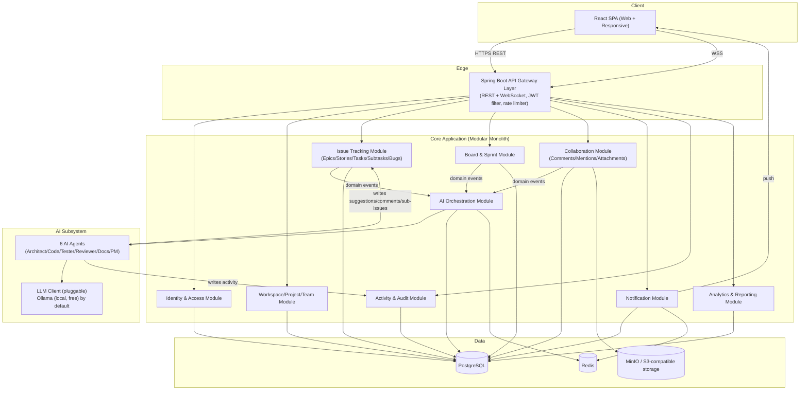
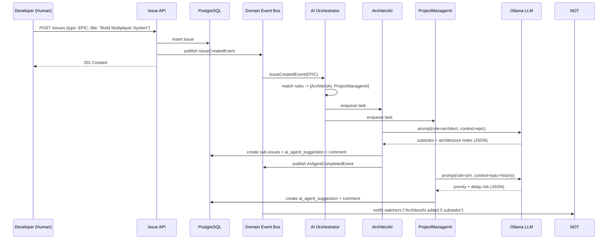
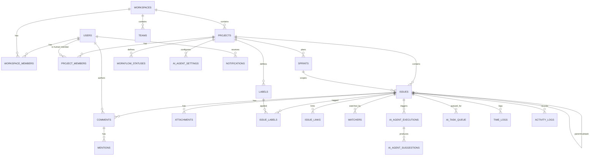
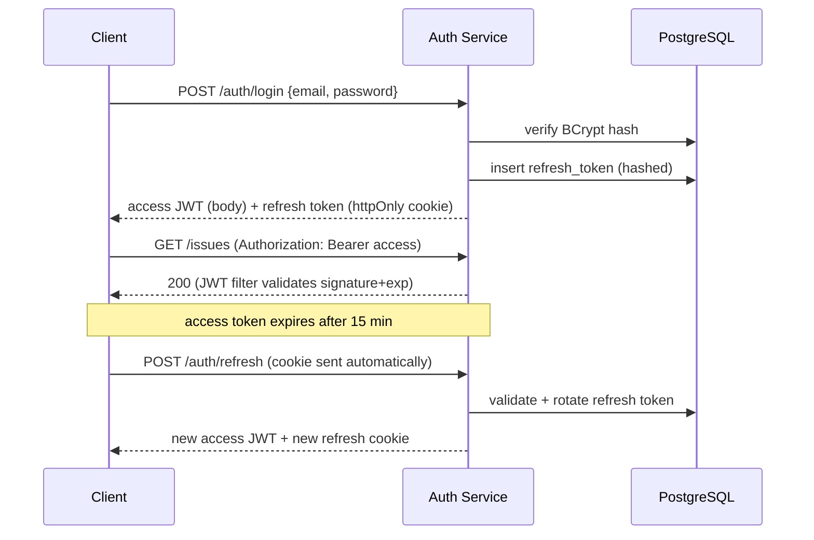

# TaskForge AI Studio — System Architecture Specification

**A production-grade, AI-collaborative software engineering workspace**
Version 1.0 · Java/Spring Boot backend · React/TypeScript frontend · 100% free/open-source stack

---

## 0. Tech Stack (all free / open-source)

| Layer | Choice | Why |
|---|---|---|
| Language | Java 21 (LTS) | Virtual threads, pattern matching, records — modern, resume-relevant |
| Framework | Spring Boot 3.3 | De-facto enterprise Java standard |
| Build tool | Maven | Most common in enterprise Java shops |
| Database | PostgreSQL 16 | Free, JSONB support (needed for AI payloads), rock solid |
| Migrations | Flyway | Version-controlled schema, industry standard |
| Cache / Pub-Sub | Redis 7 | Free, doubles as cache + websocket fan-out + rate limiting |
| Auth | Spring Security 6 + JJWT | Stateless JWT, no paid IAM needed |
| Realtime | Spring WebSocket (STOMP) | Live board/notification updates |
| AI runtime (Phase 1) | Ollama (local LLM: Llama 3.1 8B / Mistral 7B) | 100% free, runs locally on Apple Silicon |
| AI runtime (later, optional) | Any hosted LLM API via a pluggable client | Swap-in only, never required |
| Object storage | MinIO (local, S3-compatible) | Free; same API as AWS S3 for later cloud move |
| Frontend | React 18 + TypeScript + Vite | Fast, modern, huge hiring relevance |
| Styling | Tailwind CSS + shadcn/ui (Radix) | Professional SaaS look, free |
| Server state | TanStack Query | Caching, retries, optimistic updates |
| Client state | Zustand | Lightweight, no boilerplate |
| Charts | Recharts | Free, used for analytics |
| Drag & drop | dnd-kit | Kanban/Scrum board |
| Containers | Docker + Docker Compose | One-command local environment |
| CI | GitHub Actions | Free for public/private repos (generous free tier) |
| Testing | JUnit 5, Mockito, Testcontainers, Vitest, Playwright | Industry-standard, free |
| Docs | springdoc-openapi (Swagger UI) | Auto-generated API docs |

Everything above runs entirely on a MacBook Air M5 with no paid subscription. The only thing you "pay" with is RAM for the local LLM, which is why Ollama with a small quantized model is the Phase‑1 default.

---

## 1. Product Architecture

TaskForge AI Studio is built as a **modular monolith with clean module boundaries**, not a microservices system. This is a deliberate, interview-defensible decision: microservices solve organizational/scaling problems you don't have yet, and a well-modularized monolith can be split into services later (see §19) at near-zero rewrite cost because the module boundaries already exist.



**Key principle:** the AI Orchestration Module never talks to the database for other modules directly — it consumes domain events and calls back through the same application services a human action would use (e.g. "AI creates sub-issue" goes through the identical `IssueService.createIssue()` a controller would call). This guarantees AI and human actions are governed by the **same validation, permission, and audit rules** — there is no special backdoor for AI.

---

## 2. System Design

### 2.1 Component Responsibilities

| Component | Responsibility |
|---|---|
| API Gateway Layer | AuthN (JWT validation), AuthZ (method security), rate limiting, request/response logging, CORS |
| Identity & Access | Users, workspace membership, roles, permissions, sessions |
| Workspace/Project/Team | Workspace and project lifecycle, project configuration, team rosters (human + AI) |
| Issue Tracking | Epics/Stories/Tasks/Subtasks/Bugs, labels, links, workflow statuses |
| Board & Sprint | Kanban/Scrum board state, sprint planning, backlog ordering |
| Collaboration | Comments, @mentions, file attachments |
| Notification | In-app + websocket notifications, preferences |
| Activity & Audit | Unified human+AI activity timeline, security audit log |
| Analytics & Reporting | Velocity, burndown, cycle time, AI contribution metrics, exports |
| AI Orchestration | Listens to domain events, decides which agent(s) fire, manages the autonomous task queue, calls the LLM client, persists agent output as suggestions/comments/sub-issues |

### 2.2 Key Flow — Human creates an Epic, AI agents react



### 2.3 Non-Functional Requirements (targets)

| NFR | Phase 1 (MVP) | Phase 3 (Enterprise) |
|---|---|---|
| Concurrent users | ~50 | 10,000+ |
| API p95 latency | < 400ms | < 150ms |
| AI agent turnaround | best-effort (seconds–minutes, local model) | SLA-backed, queued & retried |
| Availability | single instance | 99.9%, multi-instance, HA Postgres |
| Data isolation | single DB, workspace_id scoping | optional schema/DB-per-tenant for large customers |

---

## 3. Database Design

### 3.1 Design principles (and why — these are good interview talking points)

1. **Polymorphic `issues` table** instead of separate `epics`, `stories`, `tasks`, `subtasks`, `bugs` tables. A single `type` discriminator column + `parent_issue_id` self-reference models the hierarchy exactly like real Jira does internally. This avoids 5 near-identical tables and lets the board/backlog query be a single `WHERE` clause instead of a 5-way UNION.
2. **AI agents are rows, not a separate system.** `project_members` has `is_ai BOOLEAN` + `ai_agent_type`. This means assignment, @mentions, activity, and permissions all reuse the exact same human-member machinery — AI teammates appear in every dropdown, board swimlane, and `@mention` autocomplete for free.
3. **UUID primary keys** everywhere (portable across services if/when extracted in Phase 3; no leaking sequential IDs).
4. **Append-only `activity_logs`** — never updated, only inserted — giving a true audit trail and a free event-sourcing-style timeline.
5. **JSONB columns** for AI agent input/output (`ai_agent_executions.input_context`, `output_result`) — schema-flexible since prompt/response shapes evolve per agent without migrations.
6. **Soft delete** (`deleted_at`) on user-facing entities (`issues`, `comments`, `projects`) — never hard-delete content users or AI created.

### 3.2 Table Catalog

**Identity & Access**

| Table | Key columns |
|---|---|
| `users` | id, email (unique), password_hash, full_name, avatar_url, timezone, status, created_at |
| `workspaces` | id, name, slug (unique), owner_id, plan_type, created_at |
| `workspace_members` | workspace_id, user_id, role (OWNER/ADMIN/MEMBER/GUEST), status (INVITED/ACTIVE), joined_at |
| `roles` | id, workspace_id (nullable = system role), name, is_custom |
| `permissions` | id, code (e.g. `ISSUE_DELETE`), description |
| `role_permissions` | role_id, permission_id |
| `refresh_tokens` | id, user_id, token_hash, jti, expires_at, revoked_at, created_by_ip |
| `audit_logs` | id, actor_id, action (LOGIN/ROLE_CHANGE/PERMISSION_CHANGE/...), target_type, target_id, ip_address, created_at |

**Workspace / Project / Team**

| Table | Key columns |
|---|---|
| `projects` | id, workspace_id, key (e.g. `TF`), name, description, type (SCRUM/KANBAN), lead_id, next_issue_number, archived_at, created_at |
| `project_members` | id, project_id, user_id (nullable), is_ai, ai_agent_type (nullable), role (PROJECT_OWNER/DEVELOPER/TESTER/AI_AGENT/VIEWER), added_at |
| `teams` | id, workspace_id, name, description |
| `team_members` | team_id, user_id |

**Issue Tracking**

| Table | Key columns |
|---|---|
| `issues` | id, project_id, issue_key (`TF-101`), type (EPIC/STORY/TASK/SUBTASK/BUG), parent_issue_id, epic_id, sprint_id, title, description (markdown), status_id, priority (LOWEST..HIGHEST), story_points, original_estimate_min, remaining_estimate_min, assignee_id, assignee_is_ai, assignee_ai_type, reporter_id, due_date, board_position, created_at, updated_at, resolved_at, deleted_at |
| `workflow_statuses` | id, project_id, name, category (TODO/IN_PROGRESS/DONE), position, color |
| `sprints` | id, project_id, name, goal, start_date, end_date, status (PLANNED/ACTIVE/COMPLETED) |
| `labels` | id, project_id, name, color |
| `issue_labels` | issue_id, label_id |
| `issue_links` | id, source_issue_id, target_issue_id, link_type (BLOCKS/RELATES_TO/DUPLICATES/CLONES) |
| `watchers` | issue_id, user_id |

**Collaboration**

| Table | Key columns |
|---|---|
| `comments` | id, issue_id, author_id (nullable), author_is_ai, author_ai_type, body (markdown), created_at, updated_at, edited, deleted_at |
| `mentions` | id, comment_id, mentioned_user_id |
| `attachments` | id, issue_id, file_name, storage_key, content_type, size_bytes, uploaded_by, uploaded_at |

**AI Subsystem**

| Table | Key columns |
|---|---|
| `ai_agent_executions` | id, issue_id, agent_type, trigger_event, status (PENDING/RUNNING/AWAITING_REVIEW/COMPLETED/FAILED), input_context (JSONB), output_result (JSONB), model_used, tokens_used, started_at, completed_at, error_message |
| `ai_agent_suggestions` | id, issue_id, execution_id, agent_type, suggestion_type (ARCHITECTURE/SUBTASK_BREAKDOWN/CODE_STRUCTURE/TEST_SCENARIOS/REVIEW_FEEDBACK/DOCUMENTATION/RISK_PREDICTION), content (JSONB), status (PENDING/ACCEPTED/REJECTED/AUTO_APPLIED), reviewed_by, reviewed_at, created_at |
| `ai_task_queue` | id, issue_id, agent_type, priority, status (QUEUED/PROCESSING/DONE/FAILED), enqueued_at, started_at, finished_at, retry_count |
| `ai_agent_settings` | project_id, agent_type, enabled, autonomy_level (MANUAL/SEMI_AUTO/AUTO), model_override |

**Notifications & Activity**

| Table | Key columns |
|---|---|
| `notifications` | id, user_id, type, title, body, link, actor_id, actor_is_ai, is_read, created_at |
| `notification_preferences` | user_id, notification_type, in_app_enabled, email_enabled |
| `activity_logs` | id, project_id, issue_id (nullable), actor_id, actor_is_ai, actor_ai_type, action_type, field_name, old_value, new_value, created_at |

**Time & Reporting**

| Table | Key columns |
|---|---|
| `time_logs` | id, issue_id, user_id, minutes_spent, work_date, description, created_at |
| `analytics_snapshots` | id, project_id, sprint_id (nullable), snapshot_date, metric_type, metric_value (JSONB) |

~31 tables total — a realistic, enterprise-scale schema without unnecessary bloat.

---

## 4. Entity Relationship Diagram



---

## 5. Backend Architecture

### 5.1 Architectural style: Clean Architecture inside a modular monolith

Each module (see §1) is internally layered identically:

```
module/
 ├─ domain/         → Entities, value objects, domain services, domain events (no Spring deps)
 ├─ application/    → Use-case services, DTOs, ports (interfaces) — orchestrates domain logic
 ├─ infrastructure/ → JPA repository implementations, external clients (LLM, storage), event publishers
 └─ web/            → REST controllers, request/response models, WebSocket handlers
```

**Dependency rule:** `web → application → domain`, and `infrastructure → application's ports → domain`. The `domain` package has zero framework imports — it is pure Java. This is what makes the system "clean": you could swap Spring for another framework, or Postgres for another database, by only touching `infrastructure`.

### 5.2 Module list (package-by-feature)

`identity`, `workspace`, `project`, `team`, `issue`, `board`, `sprint`, `collaboration`, `notification`, `activity`, `analytics`, `aiagent`, `search`, `common` (shared kernel: base entities, exceptions, util).

### 5.3 Why this design is interview-worthy

- Demonstrates **Domain-Driven Design lite** without overengineering for a project this size.
- Demonstrates understanding of **when not to use microservices** (a common senior-engineer interview question).
- Each module's `application` layer depends only on **ports (interfaces)**, so AI orchestration, notifications, etc. can be unit-tested with fakes — no Spring context needed for business-logic tests.

---

## 6. Frontend Architecture

### 6.1 Structure

Feature-based (not type-based) folder structure — each feature owns its components, hooks, and API calls. A shared `design-system` package holds primitives (Button, Card, Badge, Avatar, Modal) built on shadcn/ui + Tailwind.

### 6.2 State management split

| State type | Tool | Examples |
|---|---|---|
| Server state (anything from the API) | TanStack Query | issues, boards, comments, notifications |
| Local/UI state | Zustand | active theme, sidebar collapsed, board filters, modal open |
| Form state | React Hook Form + Zod | issue create/edit forms, auth forms |
| Realtime state | WebSocket (STOMP client) feeding into TanStack Query cache | board updates, live notifications |

### 6.3 Routing map

```
/login, /register, /forgot-password
/w/:workspaceSlug                          → Workspace dashboard
/w/:workspaceSlug/projects/:projectKey     → Project overview
/w/:workspaceSlug/projects/:projectKey/board     → Kanban/Scrum board
/w/:workspaceSlug/projects/:projectKey/backlog   → Backlog & sprint planning
/w/:workspaceSlug/projects/:projectKey/issues/:issueKey → Issue detail
/w/:workspaceSlug/projects/:projectKey/reports   → Analytics & reports
/w/:workspaceSlug/settings/*               → Members, roles, AI agent settings
/profile
```

### 6.4 Design tokens — a deliberate visual identity, not a template default

The product's thesis is **human + AI collaboration as equals**, so the one signature UI element is: **every avatar in the system — human or AI — sits in the same slot, same size, same place**, but AI teammates get a subtle animated gradient ring (not a sci-fi neon glow — a quiet 1px conic-gradient ring in the accent color) instead of a status dot. The unified activity timeline interleaves human and AI events with identical typography — the only difference is that ring. This is the "signature": AI is a teammate, not a feature bolted on.

| Token | Value | Use |
|---|---|---|
| `--color-bg` | `#0B0E14` (dark) / `#F7F8FA` (light) | App background |
| `--color-surface` | `#12161F` (dark) / `#FFFFFF` (light) | Cards, panels |
| `--color-border` | `#222733` (dark) / `#E3E6EB` (light) | Hairlines |
| `--color-primary` | `#5B6CFF` (indigo-violet) | Primary actions, links |
| `--color-accent-ai` | `#27D9C8` (teal) | AI agent ring, AI badges only — never used for human elements |
| `--color-text` | `#E6E8EC` (dark) / `#14171F` (light) | Body text |
| `--color-text-muted` | `#8A8F9C` | Secondary text |
| Type — UI | Inter | All UI text |
| Type — data/code/keys | JetBrains Mono | Issue keys (`TF-101`), code blocks, IDs |
| Radius | 8px cards, 6px controls | Consistent, not maximalist |
| Motion | 150ms ease for hover/press only; no page-load choreography | Calm, professional — not "AI demo" flashy |

---

## 7. Folder Structure

### 7.1 Backend (Maven, single repo, multi-module-ready)

```
taskforge-backend/
├─ pom.xml
├─ docker-compose.yml
├─ src/main/java/com/taskforge/
│  ├─ TaskForgeApplication.java
│  ├─ common/
│  │  ├─ entity/BaseEntity.java
│  │  ├─ exception/  (ApiException, NotFoundException, ForbiddenException, GlobalExceptionHandler)
│  │  ├─ event/DomainEvent.java
│  │  └─ util/
│  ├─ config/
│  │  ├─ SecurityConfig.java
│  │  ├─ WebSocketConfig.java
│  │  ├─ OpenApiConfig.java
│  │  └─ AsyncConfig.java
│  ├─ identity/
│  │  ├─ domain/ (User, WorkspaceMember, Role, Permission)
│  │  ├─ application/ (AuthService, UserService, JwtService)
│  │  ├─ infrastructure/ (UserRepository, RefreshTokenRepository)
│  │  └─ web/ (AuthController, UserController)
│  ├─ workspace/   (domain/application/infrastructure/web)
│  ├─ project/     (domain/application/infrastructure/web)
│  ├─ issue/       (domain/application/infrastructure/web)
│  ├─ board/       (domain/application/infrastructure/web)
│  ├─ sprint/      (domain/application/infrastructure/web)
│  ├─ collaboration/ (domain/application/infrastructure/web)
│  ├─ notification/ (domain/application/infrastructure/web)
│  ├─ activity/    (domain/application/infrastructure/web)
│  ├─ analytics/   (domain/application/infrastructure/web)
│  ├─ aiagent/
│  │  ├─ domain/ (AIAgent interface, AgentContext, AgentResult, AgentType enum)
│  │  ├─ agents/ (ArchitectAIAgent, CodeAIAgent, TesterAIAgent, ReviewerAIAgent, DocumentationAIAgent, ProjectManagerAIAgent)
│  │  ├─ orchestration/ (AIOrchestrator, EventListeners, AITaskQueueWorker)
│  │  ├─ llm/ (LLMClient interface, OllamaLLMClient, PromptTemplates)
│  │  └─ web/ (AIAgentController — manual trigger / settings endpoints)
│  └─ search/      (domain/application/infrastructure/web)
├─ src/main/resources/
│  ├─ application.yml
│  ├─ application-dev.yml
│  ├─ application-prod.yml
│  └─ db/migration/   (Flyway: V1__init.sql, V2__issues.sql, V3__ai_subsystem.sql ...)
└─ src/test/java/com/taskforge/...   (mirrors main, + integration/ using Testcontainers)
```

### 7.2 Frontend (Vite + React + TS)

```
taskforge-frontend/
├─ index.html
├─ vite.config.ts
├─ tailwind.config.ts
├─ src/
│  ├─ main.tsx, App.tsx, routes.tsx
│  ├─ design-system/      (Button, Card, Badge, Avatar, Modal, Input, Select ...)
│  ├─ lib/
│  │  ├─ api/             (axios instance, generated types, per-feature api modules)
│  │  ├─ ws/               (websocket client + topic subscriptions)
│  │  ├─ auth/             (token storage, refresh logic, AuthProvider)
│  │  └─ theme/            (dark/light theme provider)
│  ├─ features/
│  │  ├─ auth/             (LoginPage, RegisterPage, hooks)
│  │  ├─ workspace/
│  │  ├─ project/
│  │  ├─ board/            (KanbanBoard, ScrumBoard, BoardColumn, IssueCard)
│  │  ├─ backlog/          (BacklogList, SprintPlanner)
│  │  ├─ issue/            (IssueDetailPanel, CommentThread, ActivityFeed)
│  │  ├─ dashboard/
│  │  ├─ analytics/        (BurndownChart, VelocityChart, AIContributionChart)
│  │  ├─ notification/
│  │  └─ ai-agents/        (AgentAvatar, AgentActivityCard, AgentSettingsPanel)
│  └─ store/                (zustand stores: uiStore, boardFilterStore)
└─ tests/                   (Vitest unit, Playwright e2e)
```

---

## 8. API Design

### 8.1 Conventions

- Base path: `/api/v1`
- Resource-oriented REST, plural nouns, nested where ownership is strict (`/projects/{projectId}/issues`)
- Pagination: `?page=0&size=20&sort=createdAt,desc` → `Page<T>` envelope
- Errors: RFC 7807 Problem Details JSON (`type`, `title`, `status`, `detail`, `traceId`)
- Idempotency-Key header supported on POST for AI-triggered and mutation-heavy endpoints

### 8.2 Endpoint catalog (representative, not exhaustive)

| Domain | Endpoint | Notes |
|---|---|---|
| Auth | `POST /auth/register`, `POST /auth/login`, `POST /auth/refresh`, `POST /auth/logout` | JWT issuance |
| Workspaces | `GET/POST /workspaces`, `GET /workspaces/{id}`, `POST /workspaces/{id}/invite` | |
| Projects | `GET/POST /workspaces/{wsId}/projects`, `PATCH /projects/{id}` | |
| Members | `GET/POST /projects/{id}/members` (incl. adding AI agents as members) | |
| Issues | `GET/POST /projects/{id}/issues`, `GET/PATCH/DELETE /issues/{id}`, `POST /issues/{id}/transition` | `transition` = status change through workflow |
| Backlog/Board | `GET /projects/{id}/backlog`, `GET /projects/{id}/board`, `PATCH /issues/{id}/position` | |
| Sprints | `POST /projects/{id}/sprints`, `POST /sprints/{id}/start`, `POST /sprints/{id}/complete` | |
| Comments | `GET/POST /issues/{id}/comments` | triggers `@mention` parsing |
| Attachments | `POST /issues/{id}/attachments` (multipart) | stored in MinIO |
| Notifications | `GET /notifications`, `PATCH /notifications/{id}/read` | |
| Activity | `GET /issues/{id}/activity`, `GET /projects/{id}/activity` | |
| Analytics | `GET /projects/{id}/analytics/velocity`, `.../burndown`, `.../ai-contribution` | |
| AI Agents | `GET /projects/{id}/ai-settings`, `PATCH .../ai-settings`, `POST /issues/{id}/ai/invoke` | manual "ask AgentX" trigger |
| Search | `GET /search?q=...&scope=project\|workspace` | |
| WebSocket | `/ws` (SockJS+STOMP) topics: `/topic/projects/{id}/board`, `/topic/users/{id}/notifications` | |

### 8.3 Example — creating an issue

```http
POST /api/v1/projects/9f2.../issues
Authorization: Bearer <jwt>

{
  "type": "EPIC",
  "title": "Build Multiplayer System",
  "description": "Real-time multiplayer for the game lobby.",
  "priority": "HIGH"
}
```

```json
{
  "id": "a31e...",
  "issueKey": "TF-101",
  "type": "EPIC",
  "status": "BACKLOG",
  "title": "Build Multiplayer System",
  "createdAt": "2026-06-24T10:00:00Z",
  "aiAgentsTriggered": ["ARCHITECT_AI", "PROJECT_MANAGER_AI"]
}
```

---

## 9. Authentication Design

- **Password auth (Phase 1):** BCrypt (strength 12), email format + strength validated server-side.
- **Tokens:** short-lived **access JWT** (15 min, HS256 in dev / RS256 in prod) carried in `Authorization: Bearer`; long-lived **refresh token** (7 days, rotating, opaque random value hashed in DB, delivered as httpOnly+secure cookie) so XSS can't steal it.
- **Logout / token theft defense:** refresh tokens are single-use; using one issues a new one and revokes the old (`refresh_tokens.revoked_at`). Reuse of a revoked token revokes the whole chain (replay detection).
- **Email verification & password reset:** time-limited signed tokens emailed via free SMTP (e.g. Gmail SMTP for dev) — Phase 2.
- **Phase 3:** OAuth2/OIDC SSO (Google Workspace, Okta) via Spring Security's OAuth2 client — additive, doesn't replace the JWT core.



---

## 10. Authorization Design

### 10.1 Two-tier RBAC

- **Workspace role** (broad): `OWNER`, `ADMIN`, `MEMBER`, `GUEST`
- **Project role** (fine-grained, per project membership): `PROJECT_OWNER`, `DEVELOPER`, `TESTER`, `AI_AGENT`, `VIEWER`

AI agents are added to a project exactly like a human — a `project_members` row with `role = AI_AGENT` and `ai_agent_type` set. This means permission checks for AI actions reuse the identical authorization path as a human Developer, just scoped tighter.

### 10.2 Permission matrix (representative)

| Action | PROJECT_OWNER | DEVELOPER | TESTER | AI_AGENT | VIEWER |
|---|---|---|---|---|---|
| Create issue | ✅ | ✅ | ✅ | ✅ (sub-issues only) | ❌ |
| Delete issue | ✅ | ❌ | ❌ | ❌ | ❌ |
| Change project settings | ✅ | ❌ | ❌ | ❌ | ❌ |
| Comment | ✅ | ✅ | ✅ | ✅ | ❌ |
| Transition issue status | ✅ | ✅ | ✅ (to Done from In Review only) | ✅ (limited, see §18.7) | ❌ |
| Manage members/roles | ✅ | ❌ | ❌ | ❌ | ❌ |
| View board/reports | ✅ | ✅ | ✅ | ✅ | ✅ |

### 10.3 Enforcement in code

```java
@PreAuthorize("hasProjectRole(#projectId, 'PROJECT_OWNER')")
@DeleteMapping("/projects/{projectId}/issues/{issueId}")
public ResponseEntity<Void> deleteIssue(@PathVariable UUID projectId, @PathVariable UUID issueId) { ... }
```

A custom `PermissionEvaluator` (`hasProjectRole`, `hasPermission`) backs these expressions, checking `project_members` + `role_permissions` — covered in the Implementation Guide.

---

## 11. Security Design

| Threat (OWASP) | Mitigation |
|---|---|
| Broken Access Control | Method-level `@PreAuthorize` on every mutating endpoint; integration tests assert 403s |
| Injection (SQLi) | JPA/Hibernate parameterized queries only; no string-concatenated JPQL |
| Cryptographic failures | BCrypt for passwords; TLS termination at reverse proxy in prod; secrets never in source control |
| Insecure Design | Threat-modeled AI write paths (see §18.7 guardrails) |
| Security Misconfiguration | `application-prod.yml` disables actuator details, stack traces, H2 console; CORS allow-list, not `*` |
| Vulnerable Components | Dependabot/OWASP Dependency-Check in CI (free) |
| Identification & AuthN failures | Rate limiting on `/auth/*` (Bucket4j + Redis), account lockout after N failed attempts |
| Software/Data Integrity | CI runs tests + dependency scan before merge; signed container images later |
| Logging & Monitoring failures | `audit_logs` for security events; structured JSON logs (Logback) shippable to a log aggregator |
| SSRF | Attachment uploads validated by content-type allow-list and size cap; no server-side URL fetch from user input |

**AI-specific safeguards:**
- AI-generated content (code suggestions, comments) is **never executed** — it is stored as text/markdown only.
- AI cannot perform destructive actions (delete issue/project, remove member, change roles) — those permissions are simply not granted to the `AI_AGENT` role at the database level, not just hidden in the UI.
- All LLM prompts are built from a fixed template + structured context fields — user-controlled free text (issue description) is interpolated as **data**, not as instructions, and the LLM is asked to return strict JSON, which is schema-validated before being persisted (defends against prompt injection producing junk that corrupts the DB).

---

## 12. Dashboard Design

**Personal Dashboard** (`/`): "My Issues" (assigned to me, grouped by status), "Recently Updated", "Mentions of me", "AI Activity affecting my issues" widget.

**Project Dashboard**: Sprint summary (days left, scope, burndown sparkline), Status breakdown donut, Recent activity (human+AI interleaved), **AI Team Activity** card — a live feed of what each of the 6 AI agents has done in the last 24h, with accept/reject counts.

**Workspace Dashboard** (Owner/Admin only): Projects health overview, member roster (human + AI), workspace-wide activity.

---

## 13. Kanban Board Design

- Columns = a project's `workflow_statuses`, grouped by `category` (TODO/IN_PROGRESS/DONE) for swimlane coloring.
- Optional swimlanes: by Epic, or by Assignee (human and AI assignees both get a swimlane row, AI rows show the agent's avatar with the accent ring from §6.4).
- WIP limits per column (soft warning, not a hard block) — configurable, Phase 2.
- **Card anatomy:** issue key (mono font) · title · labels · priority icon · story points badge · assignee avatar · due date chip · small AI-suggestion indicator if `ai_agent_suggestions` exist pending review.
- Drag-and-drop via `dnd-kit`; drop triggers `PATCH /issues/{id}/transition` (status) and/or `/position` (ordering), optimistic update via TanStack Query, reconciled by the websocket broadcast so all viewers stay in sync.
- Quick filter bar: by assignee (incl. "AI agents" group), label, priority, "only mine".

**Scrum board** is the same component scoped to `sprint_id = activeSprintId`, with a sprint header (goal, burndown sparkline, days remaining) above the columns. Backlog view is the same issue list ungrouped, with drag-to-reorder for `board_position` and a "Plan into Sprint" action.

---

## 14. Notification System

| Type | Example | Channel (Phase 1 → Phase 2) |
|---|---|---|
| `ASSIGNED` | "You were assigned TF-104" | in-app → +email |
| `MENTIONED` | "@you was mentioned by ArchitectAI" | in-app → +email |
| `STATUS_CHANGED` | "TF-101 moved to In Review" | in-app |
| `AI_SUGGESTION_READY` | "ArchitectAI proposed 5 subtasks for TF-101" | in-app → +email digest |
| `SPRINT_AT_RISK` | "ProjectManagerAI flagged TF-Sprint-4 as likely to miss its date" | in-app → +email |
| `COMMENT_ADDED` | new comment on watched issue | in-app |

Delivery: insert into `notifications`, then push over the user's WebSocket topic (`/topic/users/{id}/notifications`) if connected; always also queryable via `GET /notifications` for the bell icon. `notification_preferences` lets users mute any type per-channel.

---

## 15. Activity Timeline

A single, append-only, chronologically merged feed per issue and per project, built from `activity_logs` (human field changes, transitions, comments) **and** `ai_agent_executions` / `ai_agent_suggestions` (AI actions) sorted by `created_at`. Rendering rule: every entry shows actor avatar (human photo or AI gradient-ring avatar from §6.4), a one-line description in active voice ("ArchitectAI added 5 subtasks", not "subtasks were added"), and a timestamp. AI entries that produced a suggestion show inline **Accept / Reject** controls when `status = PENDING`.

---

## 16. Analytics System

| Metric | Definition | Computed |
|---|---|---|
| Velocity | Story points completed per sprint | Nightly job → `analytics_snapshots` |
| Burndown/Burnup | Remaining vs. elapsed sprint time | Recomputed on each issue transition during an active sprint |
| Cycle time | Time from "In Progress" → "Done" | Derived from `activity_logs` transition timestamps |
| Lead time | Time from "Created" → "Done" | Same source |
| AI contribution % | Share of sub-issues/comments/test-cases authored by AI vs. human, and AI suggestion acceptance rate | From `ai_agent_executions` + `ai_agent_suggestions` |
| Throughput | Issues completed per week | Aggregation job |

Design choice: heavy aggregations run as a **scheduled job** (`@Scheduled`, Phase 1) writing into `analytics_snapshots` (a lightweight CQRS read model) rather than computing live on every dashboard load — keeps the board/dashboard fast as data grows.

---

## 17. Reporting System

- **Sprint Report** — scope, completed vs. spilled-over issues, velocity trend, generated as PDF (Apache PDFBox/iText, free) or CSV.
- **AI Productivity Report** — per-agent: tasks triggered, suggestions made, acceptance rate, average turnaround.
- **Time Tracking Report** — hours logged per user/issue/project, CSV export.
- Phase 2 adds a weekly email digest (scheduled job + free SMTP) summarizing the above.

---

## 18. AI Agent Design

### 18.1 Architecture

```mermaid
graph LR
    EV["Domain Events<br/>(IssueCreated, StatusChanged, CommentAdded, IssueAssignedToAI)"] --> ORCH[AI Orchestrator]
    ORCH -->|rule match| QUEUE[(ai_task_queue)]
    WORKER[AITaskQueueWorker<br/>@Scheduled poller] --> QUEUE
    WORKER --> AGENT{Agent dispatch}
    AGENT --> A1[ArchitectAI]
    AGENT --> A2[CodeAI]
    AGENT --> A3[TesterAI]
    AGENT --> A4[ReviewerAI]
    AGENT --> A5[DocumentationAI]
    AGENT --> A6[ProjectManagerAI]
    A1 & A2 & A3 & A4 & A5 & A6 --> LLMC[LLMClient interface]
    LLMC --> OLLAMA[OllamaLLMClient<br/>local, free]
    LLMC -.swap.-> OTHER[Any other provider client]
    A1 & A2 & A3 & A4 & A5 & A6 --> APP["Application services<br/>(IssueService, CommentService...)"]
    APP --> DB[(PostgreSQL)]
```

### 18.2 Core abstraction (Java)

```java
public interface AIAgent {
    AgentType type();
    boolean canHandle(AgentTrigger trigger);
    AgentResult execute(AgentContext context);
}

public record AgentContext(
    UUID issueId,
    AgentTrigger trigger,
    Map<String, Object> projectContext,   // labels, sprint, related issues
    String issueTitle,
    String issueDescription,
    List<CommentSummary> recentComments
) {}

public record AgentResult(
    AgentType agentType,
    AgentOutcome outcome,                  // SUGGESTION | SUB_ISSUES_CREATED | COMMENT_POSTED | NO_ACTION
    List<SubIssueDraft> subIssues,
    String commentMarkdown,
    Map<String, Object> structuredPayload, // persisted to ai_agent_suggestions.content
    String modelUsed,
    int tokensUsed
) {}
```

### 18.3 Orchestration rules (event → agents)

| Domain event | Agents triggered |
|---|---|
| Epic created | ArchitectAI, ProjectManagerAI |
| Story/Task created | ProjectManagerAI (priority & risk) |
| Issue moved to "In Progress" with `AI_AGENT` assignee = CodeAI | CodeAI |
| Issue moved to "In Review" | ReviewerAI, TesterAI |
| Issue moved to "Done" | DocumentationAI |
| Comment containing `@ArchitectAI` (or any agent) | that specific agent, on demand |
| Nightly cron | ProjectManagerAI (re-evaluate all active sprints for delay risk) |

### 18.4 Each agent in detail

| Agent | Trigger | Input | Output | Example for "Build Multiplayer System" |
|---|---|---|---|---|
| **ArchitectAI** | Epic/Story created, or `@ArchitectAI` mention | Title, description, project tech context | Sub-issue drafts + architecture notes comment | Creates `TF-102 Design network sync protocol`, `TF-103 Implement server-authoritative state`, `TF-104 Client-side prediction & reconciliation`, plus a comment proposing a client-server authoritative model |
| **CodeAI** | Assigned a Task/Subtask, status → In Progress | Issue title/description, related architecture notes | Implementation plan + code structure (folder/class skeleton) as a comment/attachment | Posts a class skeleton for `GameStateSynchronizer`, `PlayerInputBuffer` with method stubs and a short plan |
| **TesterAI** | Story/Task moved to In Review | Acceptance criteria, related code structure if present | Test scenario list (and optionally JUnit/Jest skeletons) as a comment | Generates scenarios: "2 clients see consistent state within 100ms", "client disconnect mid-match is handled gracefully" |
| **ReviewerAI** | Status → In Review | Diff/description of completed work (manually pasted or attached in Phase 1; Git-integrated in Phase 2) | Review comment: risks, missed edge cases, suggestions | "Consider clock drift between clients; recommend server timestamp reconciliation" |
| **DocumentationAI** | Status → Done | Final issue content + accepted code/architecture notes | Markdown technical doc, appended to project docs | Generates a short "Multiplayer Sync — Technical Overview" doc |
| **ProjectManagerAI** | Issue created, nightly cron, sprint planning | Sprint scope, due dates, velocity history, current statuses | Priority suggestions + delay-risk flags + comment | "Sprint 4 is trending 30% behind velocity; TF-103 is the critical path — recommend re-prioritizing" |

### 18.5 LLM integration (free, local-first)

```java
public interface LLMClient {
    LLMResponse complete(String systemPrompt, String userPrompt, Class<?> responseSchema);
}

@Component
public class OllamaLLMClient implements LLMClient {
    // POSTs to http://localhost:11434/api/generate (or /api/chat)
    // model: "llama3.1:8b" or "mistral:7b" — both run fine on Apple Silicon 16GB+
    // requests strict JSON output matching responseSchema, validated before returning
}
```

Each agent has its own **prompt template** (system prompt defines the persona + required JSON shape; user prompt is the structured `AgentContext`, never raw free-form chat). Example (ArchitectAI, abbreviated):

```
SYSTEM: You are ArchitectAI, a software architecture assistant inside a project
management tool. Given an epic, propose 3-7 concrete subtasks and a short
architecture note. Respond ONLY with JSON matching: 
{"subtasks":[{"title":"","description":""}], "architectureNotes":""}

USER: Epic title: "Build Multiplayer System"
Epic description: "<the user's text>"
Project tech context: {"language":"Java","frontend":"React"}
```

The `LLMClient` interface means Ollama can later be swapped for any other provider (hosted API of your choice) with zero changes to the six agent classes — only a new `LLMClient` implementation.

### 18.6 Autonomous execution (AI "does tasks on its own")

1. A human assigns an issue to an AI teammate (e.g., assignee = CodeAI) — exactly like assigning to a person, via the same assignee picker, because AI agents are `project_members` rows.
2. Issue transition to **In Progress** with an AI assignee enqueues a row in `ai_task_queue`.
3. `AITaskQueueWorker` (a `@Scheduled` poller in Phase 1, replaceable by a real consumer once Kafka/RabbitMQ is introduced in Phase 3) picks up queued rows, marks `PROCESSING`, builds the `AgentContext`, calls the agent, and persists the `AgentResult`.
4. Issue status auto-advances to **Awaiting Review** (a workflow status) and the human reporter/watchers get a notification — the AI never marks its own work "Done"; a human (Reviewer/Tester role) always closes the loop. This mirrors how a human contributor would actually work.

### 18.7 Guardrails (recap, expanded)

- **No destructive permissions** for the `AI_AGENT` role (DB-enforced, §10–11).
- **Suggestions before actions** where it matters: architecture/test/review/docs output always lands as a `ai_agent_suggestions` row with `status = PENDING`; only explicitly low-risk, configured-as-`AUTO` actions (e.g., auto-labeling, auto-priority-suggestion) apply immediately.
- **Per-project autonomy dial** (`ai_agent_settings.autonomy_level`): `MANUAL` (everything needs a click-to-accept), `SEMI_AUTO` (sub-issue creation auto-applied, code/test/review still need review), `AUTO` (still excludes anything destructive — autonomy only ever expands *additive* actions).
- **Full attribution & audit:** every AI action is logged with model name and token count in `ai_agent_executions`, identical rigor to a human action in `activity_logs`.

---

## 19. Future Scalability Plan

A staged path from "runs on a laptop" to "thousands of users," each step justified by a real bottleneck rather than done preemptively:

1. **Extract AI Orchestration first.** It is the most CPU/IO-heavy and latency-tolerant module — perfect first microservice. Communicate via the domain events already defined in §1/§18 (swap in-process `ApplicationEventPublisher` for a message broker).
2. **Introduce a message broker (Kafka or RabbitMQ).** Domain events (`IssueCreatedEvent`, etc.) already exist as first-class objects — only the transport changes, not the producers/consumers.
3. **CQRS read models for analytics.** `analytics_snapshots` is already a read-model pattern; extend it so dashboards never query transactional tables directly.
4. **Database scaling:** add read replicas for reporting/search load; partition `activity_logs` and `ai_agent_executions` by month (append-only, high-volume).
5. **Caching:** Redis for hot reads (board state, user session, rate limits) — already in the stack from Phase 1 for WebSocket fan-out, just widened in scope.
6. **Multi-tenancy at scale:** start with `workspace_id` row-level scoping (Phase 1–2); offer schema-per-tenant or DB-per-tenant for large enterprise customers who require strict data isolation (Phase 3).
7. **Search:** move from Postgres full-text search (Phase 1/2) to Elasticsearch/OpenSearch when cross-workspace search volume justifies it.
8. **Observability:** OpenTelemetry tracing across services, Prometheus + Grafana metrics, structured logs to Loki/ELK — introduced alongside the first service extraction so distributed debugging is possible from day one of going distributed.
9. **Deployment:** Docker Compose (Phase 1) → single Kubernetes cluster with HPA (Phase 2/3) → multi-region only if/when the customer base demands it (rarely needed even at thousands of users).
10. **LLM scaling:** local Ollama (Phase 1) → optional managed/hosted LLM provider behind the same `LLMClient` interface for higher quality/throughput at scale, with request batching and per-project rate limits to control cost.

This staged plan is itself a strong interview answer to "how would this scale?" — it shows you can justify *when*, not just *how*, to add complexity.
