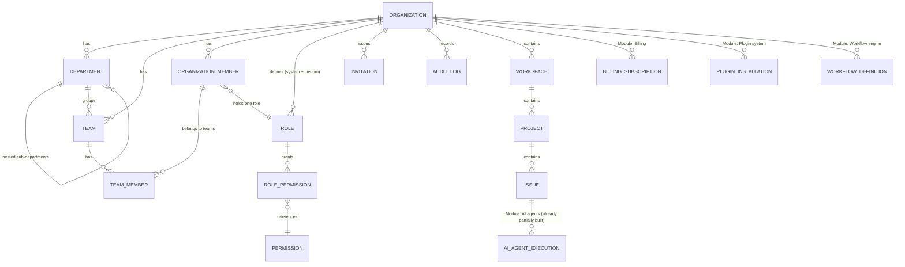

# TaskForge AI Studio — Enterprise Platform Architecture
## (Full-product architecture; Module 1 = Organizations, Departments, Teams, RBAC)

This document defines the **complete target architecture** for TaskForge AI Studio as an AI-native Engineering Operating System, then specifies Module 1 in full and shows exactly how every later module attaches to it without rework.

---

## 1. The platform's permanent foundation

Every module ever built on this platform — workflow engine, billing, plugin system, real-time collaboration, AI agents, analytics — depends on three things existing first and never changing shape:

1. **Tenant boundary** — every row in every table (eventually) belongs to exactly one `organization_id`. This is the multi-tenancy guarantee.
2. **Identity & membership** — a `User` is a person; an `OrganizationMember` is what a person *is* inside one specific organization (their role, department, team, job title). The same human can be a `DEVELOPER` in Org A and an `ORG_OWNER` in Org B.
3. **Permission evaluation** — every protected action checks one thing: "does this actor (human or AI) hold a role, in this organization, whose permission set includes this permission code?" Every module from here on just defines new permission codes; it never invents new authorization logic.

Module 1 builds exactly these three things, completely, for the whole platform's lifetime. Nothing here gets rebuilt later — later modules only *add rows* (new permission codes, new resource types in the audit log, new role templates).

---

## 2. Full entity map (target state — what Module 1 builds vs. what later modules add)



**Module 1 builds:** `Organization`, `Department`, `Team`, `TeamMember`, `OrganizationMember`, `Role`, `Permission`, `RolePermission`, `Invitation`, `AuditLog`, and retrofits the existing `Workspace`/`Project` entities to hang off `Organization` instead of floating free.

**Every later module attaches by:** (a) adding `organization_id` to its own tables, scoped through the same tenant-context mechanism, and (b) registering new `Permission` rows + checking them through the one `PermissionEvaluator` — never building a parallel auth system.

---

## 3. How each future module plugs into Module 1 (no rework guarantee)

| Future module | What it adds | How it attaches to Module 1 |
|---|---|---|
| **AI Agents** (Planner/Developer/Reviewer/Tester/Docs/Research) | New `AgentType` enum values, new agent classes | Each AI agent type gets a real `Role` row (`is_ai = true`) and a real `OrganizationMember` row, exactly like a human. Its permissions come from `RolePermission` like anyone else's — an AI agent literally cannot do anything a `Permission` row doesn't grant it. No special-cased AI authorization path, ever. |
| **Workflow engine** | `WorkflowDefinition`, `WorkflowTransition` tables (the human pipeline Owner→Manager→Lead→Developer→Reviewer→QA→Release, and the AI Planner→Developer→Reviewer→Tester→Docs pipeline) | Scoped by `organization_id`; transition guards reference `Permission` codes ("who may move an issue from In Review to Done") instead of hardcoded role checks. |
| **Billing & plans** | `BillingSubscription`, `BillingInvoice`, plan tiers | `Organization.plan_tier` already exists as a column from day one (§4.1) specifically so billing has somewhere to read/write without an `ALTER TABLE` migration touching the tenant root. |
| **Plugin system** | `PluginInstallation`, sandboxed permission grants | A plugin installation is modeled as a synthetic `OrganizationMember` with a restricted `Role` — reuses the exact same permission-checking path; a plugin can never exceed what its `Role`'s `RolePermission` rows allow. |
| **Real-time collaboration** | WebSocket presence, live cursors, typing indicators | Presence channels are namespaced `org:{organizationId}:...` so realtime fan-out is tenant-isolated for free, using the same `organization_id` every other query already filters on. |
| **Analytics & reporting** | Velocity, contribution graphs, AI usage | All read models (`analytics_snapshots` etc.) carry `organization_id` + optionally `department_id`/`team_id`, both of which already exist from Module 1 — no schema surprises later. |
| **Notifications** | Assignment/review/AI-completion alerts | `Notification.organization_id` added; delivery preference checks the recipient's `OrganizationMember` row for their org-scoped settings. |
| **Audit & compliance** | SOC2-style reporting, data export | `AuditLog` (built in Module 1) is already the single append-only ledger every module writes to — reporting just queries it, it doesn't need a new logging mechanism. |
| **Departments-based smart assignment, workload balancing** | Assignment algorithm | Reads `OrganizationMember.department_id`/`team_id` and workload counts already modeled in Module 1 — the algorithm is new, the data it reads is not. |

This is the concrete meaning of "designed so a 100+ employee company never requires an architectural rewrite": every column a future module needs to read already exists on day one, even though the module that *acts* on it doesn't exist yet.

---

## 4. Module 1 — complete specification

### 4.1 Tables

```
organizations
  id UUID PK
  name, slug (unique)
  owner_id -> users.id
  plan_tier VARCHAR  -- FREE/TEAM/BUSINESS/ENTERPRISE — read by future Billing module, unused (but real) for now
  status VARCHAR     -- ACTIVE/SUSPENDED/ARCHIVED
  settings JSONB      -- feature flags / future plugin config; not faked, genuinely an empty/extensible JSON store
  created_at

departments
  id UUID PK, organization_id FK
  name, parent_department_id FK (self, nullable) -- nested departments
  lead_organization_member_id FK (nullable)
  created_at

teams
  id UUID PK, organization_id FK
  department_id FK (nullable)
  name
  lead_organization_member_id FK (nullable)
  created_at

organization_members
  id UUID PK, organization_id FK, user_id FK (nullable for AI — see below)
  is_ai BOOLEAN, ai_agent_type VARCHAR (nullable)
  role_id FK -> roles.id
  department_id FK (nullable), job_title VARCHAR (nullable)
  employment_status VARCHAR  -- ACTIVE/INVITED/SUSPENDED/REMOVED
  joined_at, removed_at (nullable)

team_members
  team_id FK, organization_member_id FK   -- composite PK

roles
  id UUID PK
  organization_id FK (nullable = system template role, cloned into orgs on creation)
  code VARCHAR        -- e.g. ORG_OWNER, DEVELOPER, AI_PLANNER, or a custom code for custom roles
  name, description
  is_system BOOLEAN   -- true = one of the 16 built-in roles, cannot be deleted
  is_ai BOOLEAN
  created_at

permissions
  id UUID PK
  code VARCHAR UNIQUE  -- "resource:action", e.g. "project:create", "member:invite", "role:manage"
  resource VARCHAR, action VARCHAR, description

role_permissions
  role_id FK, permission_id FK   -- composite PK

invitations
  id UUID PK, organization_id FK
  email VARCHAR (nullable if code/link based), role_id FK
  invited_by FK -> organization_members.id
  token VARCHAR UNIQUE        -- used for link/code-based invites
  method VARCHAR              -- EMAIL/LINK/CODE
  status VARCHAR              -- PENDING/ACCEPTED/REJECTED/EXPIRED/REVOKED
  expires_at, created_at, accepted_at (nullable)

audit_logs
  id UUID PK, organization_id FK
  actor_organization_member_id FK (nullable for system actions)
  action VARCHAR              -- e.g. "MEMBER_INVITED", "ROLE_CHANGED", "ORG_CREATED"
  resource_type VARCHAR, resource_id UUID (nullable)
  metadata JSONB
  ip_address VARCHAR (nullable)
  created_at
```

`workspaces` (existing table) gains `organization_id FK NOT NULL`. `projects` keeps `workspace_id`; tenant scoping flows transitively (project → workspace → organization), but every query that needs fast org-level filtering can also resolve it directly without a join because `organization_id` is denormalized onto `workspaces` from day one — this is the standard, deliberate multi-tenant denormalization, not a shortcut.

### 4.2 The 16 roles (system templates, cloned into every new organization)

`ORG_OWNER`, `ORG_ADMIN`, `ENGINEERING_MANAGER`, `TEAM_LEAD`, `DEVELOPER`, `QA_ENGINEER`, `DESIGNER`, `PRODUCT_MANAGER`, `HR`, `GUEST`, `AI_PLANNER`, `AI_DEVELOPER`, `AI_REVIEWER`, `AI_TESTING_AGENT`, `AI_DOCUMENTATION_AGENT`, `AI_RESEARCH_AGENT`.

Each ships as a row in `roles` with `organization_id = NULL` (the template). When an organization is created, every template role is **cloned** into that org (`organization_id = the new org`) with its `role_permissions` copied. This is what makes per-organization custom roles possible later without special-casing: a custom role is just another row with `is_system = false`.

### 4.3 Permission matrix (representative — full matrix ships as seed data, ~70 permission codes)

| Permission code | OWNER | ADMIN | ENG_MGR | LEAD | DEV | QA | DESIGNER | PM | HR | GUEST | AI_PLANNER | AI_DEV | AI_REVIEWER | AI_TEST | AI_DOCS | AI_RESEARCH |
|---|---|---|---|---|---|---|---|---|---|---|---|---|---|---|---|---|
| `organization:manage` | ✅ | ✅ | ❌ | ❌ | ❌ | ❌ | ❌ | ❌ | ❌ | ❌ | ❌ | ❌ | ❌ | ❌ | ❌ | ❌ |
| `member:invite` | ✅ | ✅ | ✅ | ❌ | ❌ | ❌ | ❌ | ❌ | ✅ | ❌ | ❌ | ❌ | ❌ | ❌ | ❌ | ❌ |
| `role:manage` | ✅ | ✅ | ❌ | ❌ | ❌ | ❌ | ❌ | ❌ | ❌ | ❌ | ❌ | ❌ | ❌ | ❌ | ❌ | ❌ |
| `department:manage` | ✅ | ✅ | ✅ | ❌ | ❌ | ❌ | ❌ | ❌ | ✅ | ❌ | ❌ | ❌ | ❌ | ❌ | ❌ | ❌ |
| `project:create` | ✅ | ✅ | ✅ | ✅ | ❌ | ❌ | ❌ | ✅ | ❌ | ❌ | ❌ | ❌ | ❌ | ❌ | ❌ | ❌ |
| `issue:create` | ✅ | ✅ | ✅ | ✅ | ✅ | ✅ | ✅ | ✅ | ❌ | ❌ | ✅ | ✅(sub-issues) | ❌ | ❌ | ❌ | ❌ |
| `issue:delete` | ✅ | ✅ | ✅ | ❌ | ❌ | ❌ | ❌ | ❌ | ❌ | ❌ | ❌ | ❌ | ❌ | ❌ | ❌ | ❌ |
| `issue:assign` | ✅ | ✅ | ✅ | ✅ | ❌ | ❌ | ❌ | ✅ | ❌ | ❌ | ✅ | ❌ | ❌ | ❌ | ❌ | ❌ |
| `issue:transition` | ✅ | ✅ | ✅ | ✅ | ✅ | ✅(to QA states) | ✅ | ✅ | ❌ | ❌ | ✅ | ✅ | ✅ | ✅ | ✅ | ❌ |
| `ai:invoke` | ✅ | ✅ | ✅ | ✅ | ✅ | ✅ | ❌ | ✅ | ❌ | ❌ | n/a | n/a | n/a | n/a | n/a | n/a |
| `ai:configure_provider` | ✅ | ✅ | ❌ | ❌ | ❌ | ❌ | ❌ | ❌ | ❌ | ❌ | ❌ | ❌ | ❌ | ❌ | ❌ | ❌ |
| `audit_log:view` | ✅ | ✅ | ✅(own dept) | ❌ | ❌ | ❌ | ❌ | ❌ | ✅ | ❌ | ❌ | ❌ | ❌ | ❌ | ❌ | ❌ |
| `billing:manage` | ✅ | ❌ | ❌ | ❌ | ❌ | ❌ | ❌ | ❌ | ❌ | ❌ | ❌ | ❌ | ❌ | ❌ | ❌ | ❌ |

(Full seed data — every permission code, every role, ships in the Flyway migration, not abbreviated like the table above.)

### 4.4 Authentication flow change: organization-scoped sessions

A person can belong to multiple organizations, so a single JWT cannot statically encode "your role." The flow becomes:

1. `POST /auth/login` → identity-only JWT (who you are, no org context).
2. `GET /organizations` → list of orgs this user belongs to.
3. `POST /organizations/{id}/activate` → **org-scoped JWT**, embedding `organizationId`, `organizationMemberId`, and `roleCode`. This is the token used for every subsequent API call. Switching organizations = calling `activate` again for a different org and swapping the stored token — this is the real implementation of "organization switching," not a UI-only toggle.
4. Every protected endpoint resolves the active `OrganizationMember` from the token, then asks the `PermissionEvaluator`: does this member's role carry the required permission code?

### 4.5 `PermissionEvaluator` — the one authorization path for the entire platform

```java
@PreAuthorize("@permissionEvaluator.hasPermission('issue:delete')")
```

resolves to: look up the caller's `OrganizationMember` (from the org-scoped JWT) → its `Role` → that role's `RolePermission` set → does it contain `issue:delete`? This single mechanism is what every module in §3 reuses verbatim.

---

## 5. What Module 1 deliberately does NOT yet do (so nothing here is mislabeled as done)

- It does not yet retrofit every existing controller (issue/comment/etc.) to call `@PermissionEvaluator` instead of the old `requireMember` check — that rewiring is mechanical and is Module 1.5, listed explicitly at the end of the implementation so it isn't silently skipped.
- It does not implement billing, plugins, or the workflow engine — it only guarantees their tables can be added later without touching `Organization`/`Role`/`Permission`.
- Department-based smart assignment is a future algorithm; Module 1 only guarantees the `department_id`/`team_id` data it will read already exists and is populated.

Continuing now with full production-quality code for everything in §4.
